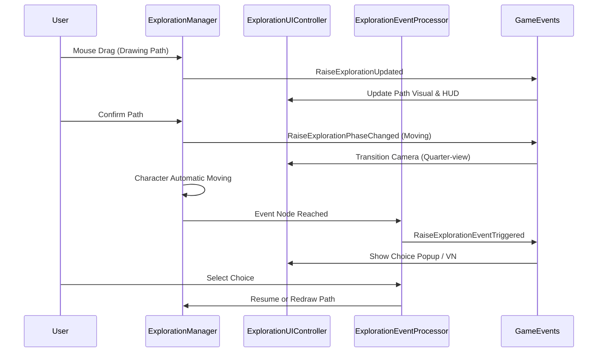

# 🕵️ 탐사(Exploration) 시스템 구조 및 가이드

이 문서는 KPA_Project의 **탐사(Exploration) 시스템**의 아키텍처와 주요 컴포넌트 간의 상호작용을 설명합니다.

---

## 🏗️ 1. 시스템 아키텍처 (Layered Architecture)

시스템은 크게 **데이터(Data)**, **제어(Logic)**, **표현(UI)**의 세 레이어로 구성되어 명확한 역할 분담을 지향합니다.

### 📂 데이터 레이어 (Data Layer)
- **`ExplorationStageData` (ScriptableObject)**
  - 스테이지의 정적인 설계도입니다.
  - **구성**: 시작 위치(`startPosition`), 제한 시간, 최대 선택권, 이벤트 노드(`ExplorationNodeData`) 목록.
- **`ExplorationState` (Class)**
  - 현재 탐사 세션의 실시간 상태를 담고 있습니다.
  - **구성**: 남은 시간, 현재 위치(`currentPosition`), 드래그 경로(`pathSegments`), 획득 결과물.

### ⚙️ 제어 레이어 (Logic Layer)
- **`ExplorationManager` (Singleton)**
  - 탐사 전체의 흐름을 중앙에서 관리하는 브레인입니다.
  - **역할**: 마우스 입력 처리(경로 그리기), NavMesh 기반 경로 계산, 자동 이동 코루틴 제어.
- **`ExplorationEventProcessor` (Singleton)**
  - 탐사 중 발생하는 각종 이벤트(함정, 보상, 상호작용)의 **성공/실패 판정**을 담당합니다.
  - **역할**: 플레이어의 스탯/아이템 보유 여부에 따른 선택지 필터링 및 효과 적용.

### 🖥️ 표현 레이어 (UI/UX Layer)
- **`ExplorationUIController`**
  - 유저에게 시각적 정보를 전달하고 입력을 중간에서 가이드합니다.
  - **역할**: HUD(시간/골드) 갱신, 이벤트 팝업 노출, VN(비주얼 노벨) 컷씬 연출, **카메라 시점 전환(Top-view ↔ Quarter-view)**.
- **`GameEvents` (Event Bus)**
  - 각 시스템 간의 결합도를 낮추기 위한 중앙 통로입니다.
  - **구성**: `OnExplorationStarted`, `OnExplorationPhaseChanged`, `OnExplorationUpdated` 등.

---

## 🔄 2. 탐사 프로세스 및 페이즈 (Phases)

탐사는 총 4가지 주요 상태(`ExplorationPhase`)를 순환하며 진행됩니다.

### 🟦 Planning Phase (경로 계획)
- **카메라**: 탑뷰(Top-view)
- **행동**: 유저는 마우스 드래그를 통해 경로를 직접 그립니다.
  - **NavMesh**: 클릭 지점이 떨어져 있을 경우, 이전 지점과 현재 지점을 NavMesh로 자동 연결합니다.
  - **Undo**: 마우스 우클릭 시 마지막으로 그린 세그먼트를 삭제합니다.
  - **Obstacle**: 벽에 닿으면 드로잉이 자동으로 중단됩니다.

### 🟩 Moving Phase (자동 이동)
- **카메라**: 쿼터뷰(Quarter-view)
- **행동**: 플레이어 캐릭터가 계획된 경로를 따라 자동 이동합니다.
  - **Time Consumption**: 이동 거리에 비례하여 탐사 시간이 실시간으로 소모됩니다.
  - **Scan**: 주변의 단서(Clue)를 자동 감지하거나 상호작용 가능한 프롬프트를 띄웁니다.

### 🟧 EventProcessing Phase (이벤트 처리)
- **행동**: 위험 조우 시 화면에 선택지 팝업이 나타나거나 VN 연출이 시작됩니다.
  - **Choices**: 플레이어의 스탯이나 보유한 단서에 따라 선택 가능 여부가 결정됩니다.
  - **Result**: 선택 결과에 따라 시간 가산/차감, 골드 획득, 혹은 경로 재설정이 필요할 수 있습니다.

### 🟥 Result Phase (정산)
- **행동**: 탐사 성공(탈출구 도달) 또는 실패(시간 초과) 결과를 출력합니다.
  - **Save**: 모든 결과 데이터는 즉시 `SaveSystem`을 통해 저장됩니다.

---

## 🛠️ 3. 주요 클래스 간 상호작용 (Diagram)

---

## 📌 4. 유지보수 가이드

- **새로운 스테이지 추가**: `ExplorationStageData` ScriptableObject를 생성하고 인스펙터에서 `startPosition`과 `nodes` 좌표를 설정하세요.
- **새로운 이벤트 효과 추가**: `ExplorationEventProcessor`의 `ApplyChoiceEffect` 메서드에 로직을 추가하세요.
- **카메라 뷰 수정**: `ExplorationUIController`의 `TransitionCamera` 코루틴 내부에서 연출을 보완할 수 있습니다.

---
**업데이트 날짜**: 2026-04-03
**관련 문서**: [프로젝트 개발 가이드라인](file:///d:/KPA_Project/Docs/ProjectGuidelines.md)
