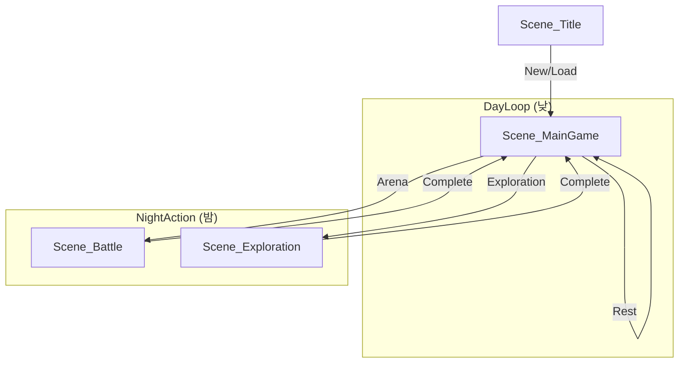

# 프로젝트 KPA: 씬 구조 및 전환 가이드

이 문서는 게임 내 주요 씬들의 역할과 상호 전환 관계, 그리고 데이터 전달 방식에 대해 정의합니다.

## 1. 전역 씬 구조 (Scene Hierarchy)

본 프로젝트는 `Scene_MainGame`을 중심 허브로 두고, 특정 이벤트 발생 시 서브 시스템(배틀, 탐사)으로 진입했다가 다시 복귀하는 구조를 가집니다.

---

## 2. 주요 씬 상세 역할

### 2.1 Scene_Title
*   **역할**: 게임의 시작점 및 세이브 데이터 로드.
*   **진입**: 어플리케이션 실행 시 최우선 로드.
*   **탈출**: `Scene_MainGame`으로 전환.

### 2.2 Scene_MainGame (Hub)
*   **역할**: 게임의 핵심 루프(DayLoop) 수행.
    *   **아침**: 전투체 스케줄링.
    *   **낮**: 지도 이동 및 장소 인터랙션 (훈련 보조, 상점 등).
    *   **밤**: 심야 활동 선택 및 결과 보고.
*   **특징**: `GameManager`가 상주하며 모든 `GameState`를 관리합니다.

### 2.3 Scene_Battle
*   **역할**: 아레나 전투 및 승강전 수행.
*   **진입**: `GameManager.StartArenaBattle()` 호출 시 진입.
*   **탈출**: 전투 종료 후 리포트 생성 및 `Scene_MainGame` 복귀.

### 2.4 Scene_Exploration
*   **역할**: 던전 탐사 및 이벤트 조우.
*   **진입**: 밤 행동 중 '탐사' 선택 시 진입.
*   **탈출**: 탐사 목표 달성 또는 탈출 시 `Scene_MainGame` 복귀.

---

## 3. 데이터 동기화 매커니즘

씬 간 전환 시 데이터 유실을 방지하기 위해 다음과 같은 정적(Static) 데이터 전달 클래스를 사용합니다.

### 3.1 BattleSceneData
배틀 씬과 메인 씬 사이의 가교 역할을 합니다.
- **주요 필드**:
    - `gameState`: 현재 게임의 전체 상태 복사본.
    - `playerUnit / opponentUnit`: 전투를 위해 가공된 유닛 데이터.
    - `battleReport`: 전투 결과 데이터 (승패, 스탯 변화 등).

### 3.2 ExplorationManager (또는 관련 Data 클래스)
탐사 결과를 메인 게임으로 전달합니다.
- 탐사 중 획득한 골드, 아이템, 발견된 단서 등을 `GameState`에 즉시 또는 귀환 시 반영합니다.

---

## 4. 씬 네이밍 규칙 (Scene Naming Convention)

본 프로젝트는 모든 씬 파일 명칭에 다음과 같은 규칙을 적용합니다.

*   **형식**: `Scene_[Name]`
*   **표기법**: `Scene_` 접두사 + PascalCase
*   **목적**: 프로젝트 내 모든 문자열 참조(LoadScene)의 일관성 확보 및 에셋 식별 용이성 증대.

> [!IMPORTANT]
> **싱글톤 유지**:
> `GameManager`는 `DontDestroyOnLoad` 상태이므로 씬 전환 시 파괴되지 않습니다. 새로운 씬에 진입했을 때 UI 컨트롤러들이 `GameManager.Instance`를 통해 상태를 즉시 참조할 수 있도록 설계되어 있습니다.
